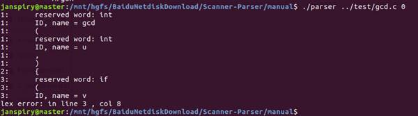

# Cminus Compiler
 编译原理课程作业-Cminus语言的词法及语法分析器实现


## 设计思想

### 词法分析

使用确定有限态自动机（DFA）实现与Lex自动分析两种方式实现。

### 语法分析

使用递归下降方式与Yacc自动分析两种方式实现。

程序部分代码使用STL简化设计，对于重复部分使用自定义结构体或者全局函数进行重构。


## 设计思路

### **手工方式**

#### **词法分析：**

首先通过分析词法规则，使用手工的方式构造DFA，自定义结构体记录每个状态节点的状态，节点的分为接受与非接受多个状态，同时接受态又分为文件结束、保留字，ID等多个状态,使用的DFA如下：


**DFA示意图**

对于每一次Token的获取，从源文件的当前字符开始处理，从输入缓冲区中读出字符，在DFA中进行转移，直到转移失败，判断当前节点是否是可接受状态，若是，将行号，节点状态，符号串转入Token转换程序，得到具体的符号串类型（数字、保留字、ID等）后返回，否则转到错误处理。然后回退转移失败的字符到缓冲区，将DFA设置为初始状态，准备下次匹配新的符号串。

对于评论，分析结束后并不直接返回，重新将DFA设置为初始状态，匹配新的符号串。

重复上述过程直至文件结束，即可得到所有的符号。

#### **语法分析：**

语法分析采用递归下降的算法，转换后的EBNF文法规则如下：

```
program → declaration-list

declaration-list → declaration-list {declaration}

declaration → var-declaration|fun-declaration

var-declaration → type-specifier ID | type-specifier ID[NUM];

type-specifier → int|void

fun-declaration → type-specifier ID(params)|compound-stmt

params → params-list|void

param-list → param{,param}

param → type-specifier ID{[]}

compound-stmt → {local-declarations statement-list}

local-declarations → empty{var-declaration}

statement-list → {statement}

statement → expression-stmt|compound-stmt|selection-stmt|

iteration-stmt|return-stmt

expression-stmt → [expression];

selection-stmt → if(expression) statement [else statement]

iteration-stmt → while(expression) statement

return-stmt → return[expression];

expression → var=expression|simple-expression

var → ID|ID[expression]

simple-expression → additive-expression {relop additive-expression}

relop → <=|<|>|>=|==|!=

additive-expression → term{addop term}

addop → +|-

term → factor{mulop factor}

mulop → *|/

factor → (expression)|var|call|NUM

call → ID(args)

args → arg-list|empty

arg-list → expression{, expression}
```


递归下降构建语法树时，对于每条产生式设计函数，调用词法分析的函数，返回当前Token并准备下次读取。 分解产生式进行Match判断下一个产生式的入口，在Match的同时函数会判断当前Token 的合法性同时读取下一个Token。对于左因子与间接递归的情况，在本条产生式函数内进行多次Match，直至匹配到出现差异的地方进行递归函数的调用，这个过程中，根据产生式构建带有节点性质的语法树。由于手动消除了间接递归，部分情况需要将父节点的属性向下传递，帮助确定子节点的性质。节点性质与相对关系如下：

 

| **节点性质**    | **详细说明**                   |
| --------------- | ------------------------------ |
| Intk            | Int值                          |
| VoidK           | 空值                           |
| IdK             | 标识符                         |
| ConstK          | 常量                           |
| Var_DeclK       | 变量声明（数组变量，普通变量） |
| FuncK           | 函数                           |
| ParamsK         | 函数参数列表                   |
| ParamK          | 函数参数                       |
| CompK           | 复合语句                       |
| Selection_StmtK | If                             |
| Iteration_StmtK | While                          |
| Return_StmtK    | Return                         |
| AssignK         | 赋值语句                       |
| OpK             | 运算符                         |
| Arry_ElemK      | 数组                           |
| CallK           | 回调                           |
| ArgsK           | 回调函数的参数列表             |

 

### **自动分析**

#### **词法分析**

使用Lex自动分析工具进行词法的分析。使用Lex支持的正则表达实现保留字、数字、ID等Token的正则表达式。当 Lex 接收到文件或文本形式的输入时，它试图将文本与常规表达式进行匹配。 它一次读入一个输入字符，直到找到一个匹配的模式。 如果能够找到一个匹配的模式，Lex 就执行相关的动作（包括返回一个标记）。 另一方面，如果没有可以匹配的常规表达式，将会停止进一步的处理，Lex 将显示一个错误消息。

对于换行空格等返回的Token值直接设置为空跳过这些无效信息。

使用自定义函数匹配直至的所有字符以过滤评论。

在Lex文件的C语言区域编写代码，结合Lex自身的yylex（）函数，将获取的Token存入全局变量中，并将Token值附加行号等信息返回，供打印词法分析情况及判断合法性使用。

 

#### **语法分析**

使用Yacc进行语法的自动分析。在语法分析过程中，首先将定义的Token类型传递至Lex进行合法Token的获取，Lex分析过后会形成相应的Token值存入全局变量，部分过程将调用这个全局变量逐步更新树的结构。

根据C-的规则在Yacc的规则区域声明所有的合法产生式，Yacc会帮助我们自动完成规约。为了完成语法树的建立，需要在每条产生式的规约发生时定义动作进行树的更新：当遇到终结符时，将Token记录于树节点中，当遇到非终结符时，利用Yacc在规约过程中保存的状态栈，将子指针指向栈中的非终结符（$1，$2等代表此位置保存的状态），并附加一些节点性质（如参数列表，定义变量）的信息，直至完成整个分析。

在Yacc的c语言区域重载yyerror函数，使得语法分析出错时输出当前的Token与相应的位置。

为了使得Yacc定义的合法Token能被Lex接收，同时Lex分析得到的Token能被Yacc获取，并且需要保存数据用于词法的扫描与语法树的打印，在全局变量中定义树的结构，树的操作，节点的类型以及词法与语法的检查与转换，声明函数，在词法分析与语法分析中别实现获取Token、打印词法与建立语法树，打印语法树的实例。


## 程序流程图

### **手动分析**

****

词法分析过程

  

### **自动分析**

****

自动分析流程图


## 测试结果

### 正例测试

#### **输入**

```
int gcd (int u, int v)

{

if (v == 0)

 return u ;

else

 return gcd(v,u-u/v*v);

/* u-u/v*v == u mod v */

}

void main(void)

{ 

int x;

int y;

x = input();

y = input();

 output(gcd(x,y));

}
```


 

#### **输出**

- 词法分析手动


- 词法分析自动


- 语法分析手动


- 语法分析自动


 

### 反例测试

#### **输入**

```
int gcd (int u,)

{

if (v #= 0)

 return u ;

else

 return gcd(v,u-u/v*v);

/* u-u/v*v == u mod v */

}

void main(void)

{ 

int x;

int y;

x = input();

y = input();

 output(gcd(x,y));

}
```

 

#### **输出**

- 词法分析手动


- 词法分析自动



- 语法分析手动


- 语法分析自动


# 文件说明

```

├─.gitattributes 

├─auto -------------- // 自动词法语法分析器

│ ├─build.sh 

│ ├─globals.h 

│ ├─lex.l 

│ ├─main.c 

│ ├─parser 

│ ├─util.c 

│ ├─util.h 

│ └─yacc.y 

├─img 

├─manual ------------ // 手动词法语法分析器

│ ├─main.cpp 

│ ├─makefile 

│ ├─parser 

│ └─util.h 

├─README.md 

└─test -------------- // 测试文件
  
  ├─gcd.c 
  
  └─sort.c 
```

